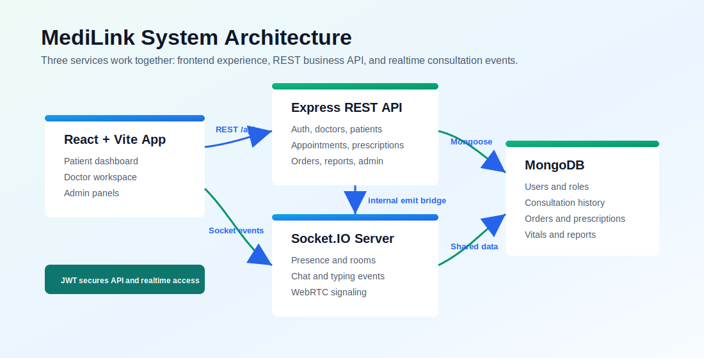
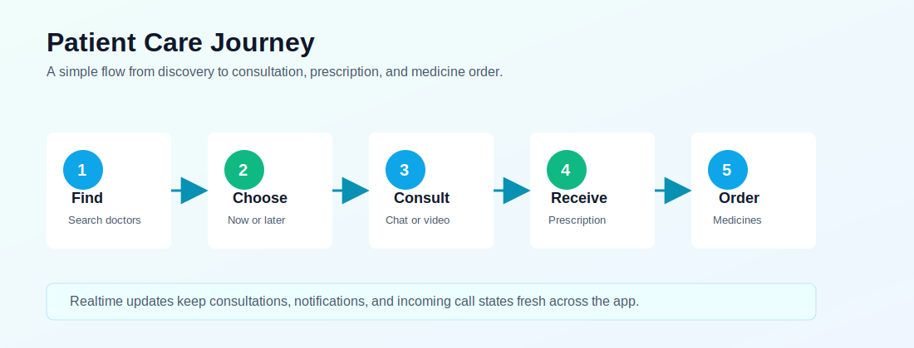
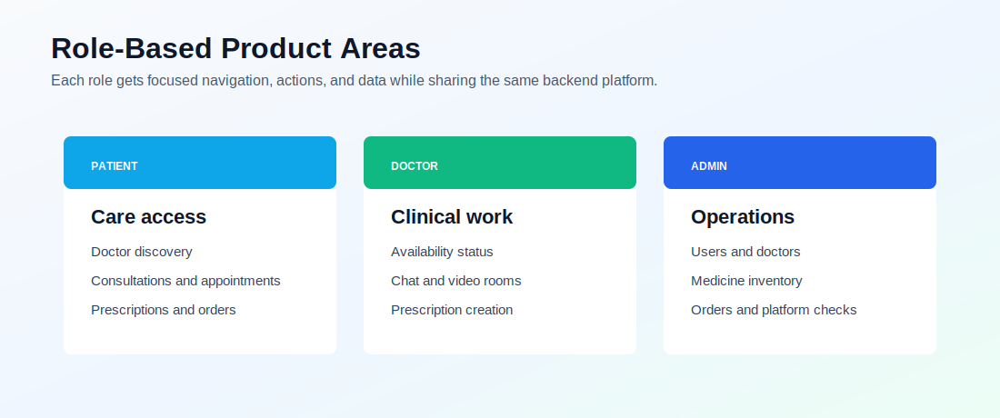

<p align="center">
  
</p>

<h1 align="center">MediLink</h1>

<p align="center">
  <strong>Full-stack telemedicine platform for patients, doctors, administrators, and realtime consultations.</strong>
</p>

<p align="center">
  
  
  
  
</p>

MediLink is a full-stack telemedicine platform for patients, doctors, and administrators. It supports doctor discovery, live consultations, chat, WebRTC video-call signaling, appointments, prescriptions, medicine orders, patient vitals, medical reports, notifications, emergency SOS, and admin operations.

The project is organized as three cooperating services:

- `backend/`: Express REST API, MongoDB models, auth, prescriptions, appointments, orders, notifications, admin tools, and Swagger docs.
- `realtime-server/`: Socket.IO service for presence, consultation rooms, chat, typing events, call events, and WebRTC signaling.
- `frontend/`: React and Vite single-page application with patient, doctor, and admin dashboards.

> Project comment: Keep the API, realtime server, and frontend running together during development. Many features, such as consultation chat and incoming-call notices, need all three services.

## Table Of Contents

- [Features](#features)
- [Visual Overview](#visual-overview)
- [Tech Stack](#tech-stack)
- [Architecture](#architecture)
- [Real Directory Structure](#real-directory-structure)
- [Prerequisites](#prerequisites)
- [Environment Variables](#environment-variables)
- [Installation](#installation)
- [Run Locally](#run-locally)
- [Demo Accounts](#demo-accounts)
- [Scripts](#scripts)
- [API Overview](#api-overview)
- [Realtime Socket Overview](#realtime-socket-overview)
- [Frontend Overview](#frontend-overview)
- [Testing](#testing)
- [Docker](#docker)
- [Deployment Notes](#deployment-notes)
- [Troubleshooting](#troubleshooting)

## Features

> Product comment: The app is built around three main journeys: patients getting care, doctors managing consultations, and admins keeping the platform organized.

### Patient

- Register, login, email verification flow, password management, and profile updates.
- Search doctors by specialty, online availability, price, and keyword.
- Start live consultations with available doctors.
- Book and manage appointments.
- View prescriptions, active prescriptions, and prescription details.
- Order medicines from prescription items.
- Manage health records, vitals, and reports.
- Receive notifications and incoming-call alerts.
- Use emergency SOS workflow and emergency support panels.
- Use MediBot AI chat when configured.

### Doctor

- Doctor dashboard with activity and consultation information.
- Online/offline availability status.
- Patient consultation rooms with chat and video-call controls.
- Create prescriptions after consultation.
- View issued prescriptions.
- Manage patient list and appointment requests.
- Access patient vitals and reports where available.

### Admin

- Admin dashboard and platform overview.
- User management and verification.
- Doctor credential review.
- Medicine inventory management.
- Medicine order fulfillment controls.
- Appointment/order visibility and operational actions.

### Realtime

- Socket.IO authentication using JWT.
- User presence and doctor availability updates.
- Consultation rooms.
- Chat messages and typing indicators.
- WebRTC signaling events for video calling.
- Backend-to-realtime internal event bridge.
- Server-sent notification stream support from the API.

## Visual Overview

These images summarize how the project works at a glance. They are stored in `docs/assets/` so they can be reused in documentation, presentations, or project submissions.

> Visual comment: Replace these diagrams with real screenshots later when the UI is final. The README already points to stable local image files, so GitHub will render them directly.

### Platform Architecture



### Patient Journey



### Role Dashboards



## Tech Stack

> Engineering comment: The stack is split by responsibility. React owns the browser experience, Express owns business data, Socket.IO owns live room events, and MongoDB stores durable records.

| Area | Technologies |
| --- | --- |
| Frontend | React 18, Vite 7, React Router, TanStack Query, Tailwind CSS utilities, Socket.IO client |
| Backend API | Node.js, Express, Mongoose, Helmet, CORS, Morgan, rate limiting, express-validator |
| Realtime | Node.js, Express, Socket.IO, JWT, MongoDB lookup models |
| Database | MongoDB, Mongoose |
| Auth | JWT access/refresh tokens, bcryptjs, role middleware |
| Uploads | Multer, Cloudinary |
| PDF/QR | html2pdf.js, qrcode |
| Email | Nodemailer |
| API Docs | Swagger UI, OpenAPI JSON |
| Tests | Jest, Supertest |
| Deployment | Railway config, backend Dockerfile, backend docker-compose |

## Architecture

> Architecture comment: The REST API and realtime server are intentionally separate. This keeps normal business requests and live consultation traffic from depending on the same request lifecycle.

```text
Browser / React SPA
       |
       | REST API calls
       v
Express API backend ---- MongoDB
       |
       | internal emit bridge
       v
Socket.IO realtime server ---- MongoDB
       ^
       | websocket/polling
       |
Browser / React SPA
```

The REST API handles durable business state: users, doctors, patients, consultations, prescriptions, reports, vitals, orders, appointments, medicines, notifications, and admin workflows.

The realtime server handles live events: room membership, messages, typing, presence, call requests, and WebRTC signaling. It shares the same MongoDB and JWT secret so it can validate users and consultation access.

## Real Directory Structure

Generated folders such as `node_modules/`, `frontend/dist/`, logs, and local `.env` files are intentionally omitted.

> Directory comment: This tree follows the current repository layout. If files are moved, update this section so new developers do not lose time searching for the right module.

```text
MediLink/
|-- backend/
|   |-- api/
|   |   `-- [...all].js
|   |-- config/
|   |   |-- database.js
|   |   `-- swagger.js
|   |-- controllers/
|   |   |-- adminController.js
|   |   |-- aiController.js
|   |   |-- appointmentController.js
|   |   |-- authController.js
|   |   |-- consultationController.js
|   |   |-- doctorController.js
|   |   |-- notificationController.js
|   |   |-- orderController.js
|   |   |-- patientController.js
|   |   |-- prescriptionController.js
|   |   |-- reportsController.js
|   |   `-- vitalsController.js
|   |-- middleware/
|   |   |-- auth.js
|   |   |-- errorHandler.js
|   |   |-- upload.js
|   |   `-- validate.js
|   |-- models/
|   |   |-- Appointment.js
|   |   |-- Consultation.js
|   |   |-- Doctor.js
|   |   |-- Medicine.js
|   |   |-- Message.js
|   |   |-- Notification.js
|   |   |-- Order.js
|   |   |-- Patient.js
|   |   |-- Prescription.js
|   |   |-- Report.js
|   |   |-- User.js
|   |   `-- Vital.js
|   |-- routes/
|   |   |-- admin.js
|   |   |-- ai.js
|   |   |-- appointments.js
|   |   |-- auth.js
|   |   |-- consultations.js
|   |   |-- doctors.js
|   |   |-- notifications.js
|   |   |-- orders.js
|   |   |-- patients.js
|   |   |-- prescriptions.js
|   |   |-- reports.js
|   |   `-- vitals.js
|   |-- socket/
|   |   |-- handlers.js
|   |   `-- ioInstance.js
|   |-- tests/
|   |   |-- admin.test.js
|   |   |-- appointments.test.js
|   |   |-- auth.test.js
|   |   |-- consultations.test.js
|   |   |-- doctors.test.js
|   |   |-- notifications.test.js
|   |   |-- orders.test.js
|   |   `-- prescriptions.test.js
|   |-- utils/
|   |   |-- apiResponse.js
|   |   |-- constants.js
|   |   |-- email.js
|   |   |-- notifications.js
|   |   |-- prescriptionVerification.js
|   |   |-- realtimeBridge.js
|   |   |-- seed.js
|   |   `-- sseHub.js
|   |-- Dockerfile
|   |-- docker-compose.yml
|   |-- package.json
|   |-- package-lock.json
|   |-- seeder.js
|   `-- server.js
|-- frontend/
|   |-- public/
|   |   |-- _redirects
|   |   |-- notification.wav
|   |   |-- ringtone.mp3
|   |   `-- tone.mp3
|   |-- src/
|   |   |-- assets/
|   |   |   |-- logo.png
|   |   |   `-- logo_2.png
|   |   |-- components/
|   |   |   |-- layout/
|   |   |   |   |-- AdminShell.jsx
|   |   |   |   |-- AppShell.jsx
|   |   |   |   |-- DoctorShell.jsx
|   |   |   |   |-- IncomingCallNotice.jsx
|   |   |   |   |-- Sidebar.jsx
|   |   |   |   `-- TopNavbar.jsx
|   |   |   `-- ui/
|   |   |       |-- ChatbotWidget.jsx
|   |   |       |-- Toast.jsx
|   |   |       `-- UI.jsx
|   |   |-- context/
|   |   |   `-- AppContext.jsx
|   |   |-- pages/
|   |   |   |-- admin/
|   |   |   |   |-- AdminDashboard.jsx
|   |   |   |   |-- AdminDoctors.jsx
|   |   |   |   |-- AdminMedicines.jsx
|   |   |   |   |-- AdminOrders.jsx
|   |   |   |   |-- AdminUsers.jsx
|   |   |   |   `-- legacy/
|   |   |   |       `-- AdminDashboardOld.jsx
|   |   |   |-- appointments/
|   |   |   |   `-- Appointments.jsx
|   |   |   |-- auth/
|   |   |   |   `-- Login.jsx
|   |   |   |-- consultation/
|   |   |   |   |-- Consultation.jsx
|   |   |   |   |-- ConsultationList.jsx
|   |   |   |   `-- components/
|   |   |   |       |-- callMachine.js
|   |   |   |       |-- ChatPanel.jsx
|   |   |   |       |-- ConsultationHeader.jsx
|   |   |   |       |-- consultationUtils.js
|   |   |   |       |-- CurrentConsultationsList.jsx
|   |   |   |       |-- IncomingCallBanner.jsx
|   |   |   |       |-- RatingModal.jsx
|   |   |   |       |-- useConsultationSession.js
|   |   |   |       `-- VideoPanel.jsx
|   |   |   |-- dashboard/
|   |   |   |   `-- Dashboard.jsx
|   |   |   |-- doctor/
|   |   |   |   |-- DoctorDashboard.jsx
|   |   |   |   |-- DoctorList.jsx
|   |   |   |   `-- DoctorPatients.jsx
|   |   |   |-- error/
|   |   |   |   `-- ErrorPage.jsx
|   |   |   |-- health-records/
|   |   |   |   |-- HealthRecords.jsx
|   |   |   |   |-- PatientReports.jsx
|   |   |   |   `-- PatientVitals.jsx
|   |   |   |-- orders/
|   |   |   |   |-- Orders.jsx
|   |   |   |   `-- components/
|   |   |   |       |-- FulfillmentSelector.jsx
|   |   |   |       |-- orderUtils.js
|   |   |   |       |-- OrdersHero.jsx
|   |   |   |       |-- OrderSummaryCard.jsx
|   |   |   |       |-- OrderTracker.jsx
|   |   |   |       |-- PrescriptionItems.jsx
|   |   |   |       |-- PromiseGrid.jsx
|   |   |   |       `-- useMedicineOrder.js
|   |   |   |-- prescriptions/
|   |   |   |   |-- CreatePrescription.jsx
|   |   |   |   |-- DoctorPrescriptions.jsx
|   |   |   |   |-- Prescription.jsx
|   |   |   |   `-- PrescriptionList.jsx
|   |   |   |-- profile/
|   |   |   |   `-- Profile.jsx
|   |   |   `-- sos/
|   |   |       |-- SOSPage.jsx
|   |   |       `-- components/
|   |   |           |-- SOSHero.jsx
|   |   |           |-- SOSInfoPanel.jsx
|   |   |           |-- sosUtils.js
|   |   |           `-- useEmergencySOS.js
|   |   |-- services/
|   |   |   |-- api.js
|   |   |   |-- keepAlive.js
|   |   |   |-- notificationStream.js
|   |   |   |-- prescriptionPdf.js
|   |   |   |-- socket.js
|   |   |   `-- sounds.js
|   |   |-- styles/
|   |   |   |-- generatedTailwindStyles.js
|   |   |   |-- globals.css
|   |   |   `-- tailwindStyles.js
|   |   |-- App.jsx
|   |   `-- main.jsx
|   |-- eslint.config.js
|   |-- index.html
|   |-- package.json
|   |-- package-lock.json
|   |-- postcss.config.js
|   |-- README.md
|   |-- tailwind.config.js
|   `-- vite.config.js|-- realtime-server/
|   |-- config/
|   |   `-- database.js
|   |-- models/
|   |   |-- Consultation.js
|   |   |-- Doctor.js
|   |   |-- Message.js
|   |   |-- Notification.js
|   |   |-- Patient.js
|   |   `-- User.js
|   |-- socket/
|   |   |-- handlers.js
|   |   `-- ioInstance.js
|   |-- utils/
|   |   |-- constants.js
|   |   `-- notifications.js
|   |-- package.json
|   |-- package-lock.json
|   |-- README.md
|   `-- server.js
|-- .gitignore
|-- package.json
|-- package-lock.json
|-- railway.json
`-- README.md
```

## Prerequisites

> Setup comment: Install prerequisites before running `npm install`. Most startup problems come from MongoDB not running or mismatched environment variables.

- Node.js 18 or newer
- npm
- MongoDB running locally, or a MongoDB Atlas connection string
- Optional: Cloudinary account for avatar/report/document uploads
- Optional: SMTP credentials for email verification and password-reset emails
- Optional: OpenAI-compatible API key for MediBot AI chat
- Optional: Docker and Docker Compose for backend + MongoDB local containers

## Environment Variables

Create local `.env` files as needed. Do not commit real secrets.

> Security comment: Keep secrets in local `.env` files or deployment provider environment settings. Never commit real JWT secrets, database URLs, SMTP passwords, Cloudinary keys, or AI provider keys.

### `backend/.env`

```env
PORT=5001
NODE_ENV=development

MONGODB_URI=mongodb://127.0.0.1:27017/medilink
MONGODB_URI_TEST=mongodb://127.0.0.1:27017/medilink_test

JWT_SECRET=replace-with-a-long-random-secret
JWT_EXPIRE=7d
JWT_REFRESH_EXPIRE=30d
PRESCRIPTION_VERIFY_SECRET=optional-separate-prescription-secret

ALLOWED_ORIGINS=http://localhost:3000,http://localhost:5173
CLIENT_URL=http://localhost:3000
API_BASE_URL=http://localhost:5001

RATE_LIMIT_WINDOW_MS=60000
RATE_LIMIT_MAX=100

REALTIME_SERVER_URL=http://localhost:5002
REALTIME_INTERNAL_SECRET=replace-with-shared-backend-realtime-secret
REALTIME_BRIDGE_TIMEOUT_MS=1200

EMAIL_HOST=smtp.gmail.com
EMAIL_PORT=587
EMAIL_USER=
EMAIL_PASS=
EMAIL_FROM=
DISABLE_EMAIL=false

CLOUDINARY_CLOUD_NAME=
CLOUDINARY_API_KEY=
CLOUDINARY_API_SECRET=

OPENAI_API_KEY=
AI_API_KEY=
AI_BASE_URL=https://api.openai.com/v1
AI_MODEL=gpt-4o-mini
```

Minimum local backend requirements are usually:

```env
MONGODB_URI=mongodb://127.0.0.1:27017/medilink
JWT_SECRET=replace-with-a-long-random-secret
ALLOWED_ORIGINS=http://localhost:3000
CLIENT_URL=http://localhost:3000
```

### `realtime-server/.env`

```env
PORT=5002
REALTIME_PORT=5002
NODE_ENV=development

MONGODB_URI=mongodb://127.0.0.1:27017/medilink
JWT_SECRET=replace-with-the-same-secret-as-backend

ALLOWED_ORIGINS=http://localhost:3000,http://localhost:5173
REALTIME_ALLOWED_ORIGINS=http://localhost:3000,http://localhost:5173
REALTIME_INTERNAL_SECRET=replace-with-shared-backend-realtime-secret

REALTIME_MAX_CONNECTIONS_PER_USER=3
REALTIME_CONSULTATION_CACHE_TTL_MS=300000
REALTIME_PING_TIMEOUT_MS=30000
REALTIME_PING_INTERVAL_MS=25000
REALTIME_MAX_BUFFER_SIZE=1000000
REALTIME_CONNECT_TIMEOUT_MS=10000
```

### `frontend/.env`

```env
VITE_API_URL=http://localhost:5001/api
VITE_REALTIME_URL=http://localhost:5002
VITE_SOCKET_TRANSPORTS=websocket
```

The frontend has sensible local defaults. If no frontend `.env` is provided, API calls use `http://localhost:5001/api`, and realtime uses `http://localhost:5002` during development.

## Installation

> Install comment: Run installs from the repository root unless a command explicitly uses `--prefix`.

From the repository root:

```bash
npm install
npm install --prefix frontend
```

The root `postinstall` installs `backend/` and `realtime-server/` dependencies. The `frontend/` dependencies are installed separately by `npm install --prefix frontend`, or by:

```bash
npm run install-all
```

## Run Locally

> Runtime comment: For the complete app experience, run backend, realtime, and frontend together.

### 1. Start MongoDB

Use local MongoDB or a MongoDB Atlas URI in your `.env` files.

### 2. Seed demo data

```bash
npm run seed --prefix backend
```

Check seed status:

```bash
npm run seed:status --prefix backend
```

Clear seeded collections:

```bash
npm run seed:clean --prefix backend
```

### 3. Start all services

```bash
npm run dev
```

This starts:

- Backend API on `http://localhost:5001`
- Realtime server on `http://localhost:5002`
- Frontend on `http://localhost:3000`

### 4. Start services separately

```bash
npm run dev --prefix backend
npm run dev --prefix realtime-server
npm run dev --prefix frontend
```

### Local URLs

| Service | URL |
| --- | --- |
| Frontend | `http://localhost:3000` |
| Backend API | `http://localhost:5001/api` |
| Backend health | `http://localhost:5001/api/health` |
| Swagger UI | `http://localhost:5001/api-docs` |
| OpenAPI JSON | `http://localhost:5001/api-docs.json` |
| Realtime Socket.IO | `http://localhost:5002/socket.io` |
| Realtime health | `http://localhost:5002/health` |

## Demo Accounts

All seeded users use:

> Demo comment: These accounts are for local development and presentation only. Change seeded credentials before any real deployment.

```text
Password: pass123
```

| Role | Email | Name |
| --- | --- | --- |
| Patient | `patient1@medilink.com` | Rahul Jha |
| Patient | `patient2@medilink.com` | Priya Sharma |
| Patient | `patient3@medilink.com` | Arjun Mehta |
| Doctor | `doctor1@medilink.com` | Dr. Anita Desai |
| Doctor | `doctor2@medilink.com` | Dr. Rohan Kapoor |
| Doctor | `doctor3@medilink.com` | Dr. Sunita Rao |
| Doctor | `doctor4@medilink.com` | Dr. Vikram Singh |
| Doctor | `doctor5@medilink.com` | Dr. Meera Nair |
| Admin | `admin@medilink.com` | Madhukar Kumar |

## Scripts

> Scripts comment: The root scripts are convenience wrappers. Service-level scripts are still available when you only want to run or test one part of the app.

### Root

| Command | Description |
| --- | --- |
| `npm run install-all` | Install root/backend/realtime dependencies and frontend dependencies |
| `npm run dev` | Run backend, realtime, and frontend together |
| `npm run backend` | Run backend dev server |
| `npm run realtime` | Run realtime dev server |
| `npm run frontend` | Run frontend dev server |
| `npm start` | Start backend in production mode |
| `npm run start:realtime` | Start realtime server in production mode |
| `npm run build` | Run backend build placeholder |

### Backend

| Command | Description |
| --- | --- |
| `npm run dev --prefix backend` | Start Express API with nodemon |
| `npm start --prefix backend` | Start Express API with Node |
| `npm run build --prefix backend` | Backend build placeholder |
| `npm run seed --prefix backend` | Seed demo users/profiles |
| `npm run seed:clean --prefix backend` | Clear seeded data |
| `npm run seed:status --prefix backend` | Show seed status |
| `npm test --prefix backend` | Run Jest/Supertest tests |
| `npm run test:coverage --prefix backend` | Run backend tests with coverage |
| `npm run test:watch --prefix backend` | Run backend tests in watch mode |

### Frontend

| Command | Description |
| --- | --- |
| `npm run dev --prefix frontend` | Start Vite dev server |
| `npm run build --prefix frontend` | Build production frontend |
| `npm run preview --prefix frontend` | Preview production build |

### Realtime

| Command | Description |
| --- | --- |
| `npm run dev --prefix realtime-server` | Start realtime server with Node watch mode |
| `npm start --prefix realtime-server` | Start realtime server with Node |
| `npm run build --prefix realtime-server` | Syntax-check realtime server entry |

## API Overview

The backend mounts all REST routes under `/api`.

> API comment: Swagger is the fastest way to test endpoints manually. Start the backend, open `/api-docs`, log in, copy the token, and authorize requests.

| Route Group | Base Path | Purpose |
| --- | --- | --- |
| Health | `/api/health` | API status, uptime, database status |
| Auth | `/api/auth` | Register, login, logout, profile, refresh token, verification, password flows |
| Patients | `/api/patients` | Patient dashboard, profile, prescriptions, consultations |
| Doctors | `/api/doctors` | Doctor search, specialty lookup, profile, status, dashboard, patients, reviews |
| Consultations | `/api/consultations` | Create, accept, end, leave, cancel, messages |
| Prescriptions | `/api/prescriptions` | Create, list, detail, status, public verification |
| Orders | `/api/orders` | Medicine orders, detail, cancellation |
| Appointments | `/api/appointments` | Appointment creation, listing, confirmation, cancellation, status |
| Vitals | `/api/vitals` | Patient vital-sign records |
| Reports | `/api/reports` | Patient medical report records |
| Notifications | `/api/notifications` | Notification list/read/delete flows |
| Admin | `/api/admin` | Dashboard, users, doctors, orders, medicines |
| AI | `/api/ai` | MediBot chat endpoint |

Swagger UI is available at:

```text
http://localhost:5001/api-docs
```

Raw OpenAPI JSON is available at:

```text
http://localhost:5001/api-docs.json
```

To test protected routes in Swagger:

1. Log in with `POST /api/auth/login`.
2. Copy `data.token`.
3. Click `Authorize`.
4. Paste the token as the bearer value.

## Realtime Socket Overview

Socket connections require a valid JWT.

> Realtime comment: Use the same `JWT_SECRET` in `backend/.env` and `realtime-server/.env`; otherwise socket authentication will fail even when REST login works.

```js
import { io } from "socket.io-client";

const socket = io("http://localhost:5002", {
  path: "/socket.io",
  auth: { token },
  transports: ["websocket"],
});
```

Common client-emitted events:

| Event | Example Payload |
| --- | --- |
| `joinConsultation` | `{ consultationId }` |
| `sendMessage` | `{ consultationId, text, attachmentUrl, attachmentType, roomId }` |
| `typing` | `{ consultationId, roomId }` |
| `stopTyping` | `{ roomId }` |
| `videoCall:request` | `{ consultationId }` |
| `videoCall:decline` | `{ consultationId }` |
| `webrtc:offer` | `{ roomId, offer }` |
| `webrtc:answer` | `{ roomId, answer }` |
| `webrtc:ice` or `webrtc:ice-candidate` | `{ roomId, candidate }` |
| `webrtc:call-ended` or `webrtc:ended` | `{ roomId, consultationId }` |
| `webrtc:media-toggle` | `{ roomId, video, audio }` |

Common server-emitted events include:

- `joinedConsultation`
- `peerJoined`
- `readyForCall`
- `receiveMessage`
- `typing`
- `stopTyping`
- `doctorOnline`
- `doctorOffline`
- `videoCall:incoming`
- `videoCall:requested`
- `videoCall:declined`
- `webrtc:offer`
- `webrtc:answer`
- `webrtc:ice-candidate`
- `webrtc:call-ended`
- `webrtc:media-toggle`
- `peerLeft`

The realtime server also exposes an internal bridge endpoint:

```text
POST /internal/emit
Header: x-realtime-secret: <REALTIME_INTERNAL_SECRET>
```

The backend uses this bridge to send realtime notifications/events when configured.

## Frontend Overview

The frontend is a React SPA. It uses app state from `src/context/AppContext.jsx`, REST helpers from `src/services/api.js`, realtime helpers from `src/services/socket.js`, route screens from `src/pages/`, reusable shell/UI components from `src/components/`, and shared Tailwind utility style maps from `src/styles/tailwindStyles.js`.

> Frontend comment: Layout code lives separately from route screen code. Start with `components/layout/` for navigation or shell changes, `components/ui/` for shared design-system primitives, and `pages/<domain>/` for screen-specific changes.

Frontend organization rules:

- `src/pages/<domain>/`: route-level screens grouped by product domain.
- `src/pages/<domain>/components/`: components and hooks used only by that domain.
- `src/components/layout/`: app shells, navigation, top bars, and global notices.
- `src/components/ui/`: shared UI primitives such as buttons, modals, filters, empty states, status pills, and skeletons.
- `src/context/`: app-wide state, routing state, auth, notifications, and call guards.
- `src/services/`: API, realtime socket, notifications, sounds, PDF generation, and keep-alive helpers.
- `src/styles/`: generated and curated Tailwind utility maps plus global theme CSS.

Important frontend pages:

| Page | File |
| --- | --- |
| Login/Register | `frontend/src/pages/auth/Login.jsx` |
| Patient dashboard | `frontend/src/pages/dashboard/Dashboard.jsx` |
| Doctor discovery | `frontend/src/pages/doctor/DoctorList.jsx` |
| Consultation room | `frontend/src/pages/consultation/Consultation.jsx` |
| Consultation history | `frontend/src/pages/consultation/ConsultationList.jsx` |
| Appointments | `frontend/src/pages/appointments/Appointments.jsx` |
| Create prescription | `frontend/src/pages/prescriptions/CreatePrescription.jsx` |
| Prescriptions | `frontend/src/pages/prescriptions/PrescriptionList.jsx`, `Prescription.jsx` |
| Orders | `frontend/src/pages/orders/Orders.jsx` |
| Health records | `frontend/src/pages/health-records/HealthRecords.jsx` |
| Vitals | `frontend/src/pages/health-records/PatientVitals.jsx` |
| Reports | `frontend/src/pages/health-records/PatientReports.jsx` |
| Profile | `frontend/src/pages/profile/Profile.jsx` |
| SOS | `frontend/src/pages/sos/SOSPage.jsx` |
| Admin dashboard | `frontend/src/pages/admin/AdminDashboard.jsx` |
| Admin users/doctors/orders/medicines | `frontend/src/pages/admin/AdminUsers.jsx`, `AdminDoctors.jsx`, `AdminOrders.jsx`, `AdminMedicines.jsx` |

## Testing

Backend tests live in `backend/tests/`.

> Testing comment: Run backend tests after changing controllers, routes, middleware, models, or authentication logic. UI-only README changes do not require test execution.

Run all backend tests:

```bash
npm test --prefix backend
```

Run with coverage:

```bash
npm run test:coverage --prefix backend
```

Tests use `MONGODB_URI_TEST` when provided. Otherwise they default to:

```text
mongodb://localhost:27017/medilink_test
```

## Docker

The Docker setup is in `backend/`.

> Docker comment: The current Docker files focus on the backend and MongoDB support. The frontend and realtime server can still be run separately during local development.

```bash
cd backend
docker compose up -d
```

Seed inside the backend container:

```bash
docker compose exec medilink npm run seed
```

Optional Mongo Express profile:

```bash
docker compose --profile dev up -d
```

## Deployment Notes

> Deployment comment: Production deployment needs three public pieces: static frontend, API service, and realtime service. Keep allowed origins and service URLs aligned.

### Backend API

- Deploy `backend/` as a Node service.
- Set `MONGODB_URI`, `JWT_SECRET`, `ALLOWED_ORIGINS`, and `CLIENT_URL`.
- Set `REALTIME_SERVER_URL` and `REALTIME_INTERNAL_SECRET` if using the realtime bridge.
- Swagger is mounted by the API at `/api-docs`.

### Realtime Server

- Deploy `realtime-server/` as a separate Node service.
- Use the same `MONGODB_URI` and `JWT_SECRET` as the API.
- Set `REALTIME_ALLOWED_ORIGINS` to the frontend domain.
- Set `REALTIME_INTERNAL_SECRET` to match backend.

### Frontend

- Deploy `frontend/` as a static Vite build.
- Set `VITE_API_URL` to the deployed API URL plus `/api`.
- Set `VITE_REALTIME_URL` to the deployed realtime server URL.
- `frontend/public/_redirects` is included for SPA routing on hosts that support Netlify-style redirects.

## Troubleshooting

> Debug comment: When something breaks, identify which service owns the failure first: browser UI, REST API, realtime socket, database, uploads, email, or AI provider.

### API starts but requests fail with CORS

Check that the frontend URL is included in backend `ALLOWED_ORIGINS`.

```env
ALLOWED_ORIGINS=http://localhost:3000,http://localhost:5173
```

### Socket connection fails

Check:

- Realtime server is running on `http://localhost:5002`.
- Realtime `JWT_SECRET` matches backend `JWT_SECRET`.
- Frontend `VITE_REALTIME_URL` points to the realtime server.
- Realtime `REALTIME_ALLOWED_ORIGINS` includes the frontend origin.

### Login works but realtime events do not

The REST API and realtime server are separate services. Make sure both are running:

```bash
npm run dev --prefix backend
npm run dev --prefix realtime-server
```

### Uploads fail

Cloudinary values are required for upload endpoints:

```env
CLOUDINARY_CLOUD_NAME=
CLOUDINARY_API_KEY=
CLOUDINARY_API_SECRET=
```

### Emails are not sent

Set SMTP variables, or disable emails in development:

```env
DISABLE_EMAIL=true
```

### AI chat fails

Set one of:

```env
OPENAI_API_KEY=
AI_API_KEY=
```

Optionally configure:

```env
AI_BASE_URL=https://api.openai.com/v1
AI_MODEL=gpt-4o-mini
```

### Git pull/rebase got stuck

If a pull with rebase gets interrupted, check:

```bash
git status
git reflog --date=local -n 20
```

If you are mid-rebase and want to return to the pre-pull local state:

```bash
git rebase --abort
```

If Git reports stale rebase metadata after the working tree is already restored, inspect `.git/rebase-merge` before deleting anything. Do not use destructive commands such as `git reset --hard` unless you are certain you want to discard local work.

## License

> License comment: A license tells others how they can use, modify, and share the code. Add one before sharing the repository widely.

This repository does not currently declare a license. Add a `LICENSE` file before distributing or publishing the project publicly.
